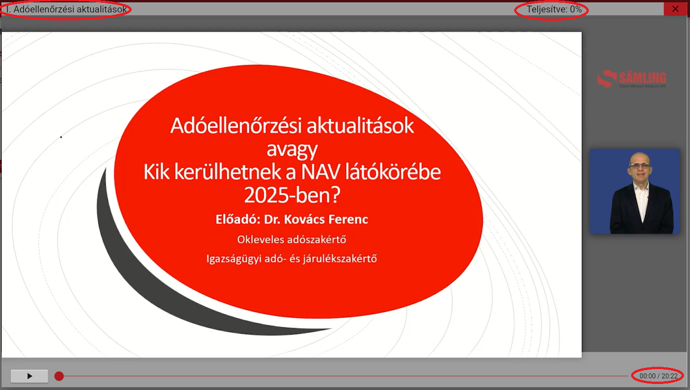

* A videóablakban a legfelső sávban, bal oldalt mindig az adott anyag címét olvashatja (Pl.: Adóellenőrzési aktualitások).   
* Mellette jobb oldalon a már teljesített időtartamot láthatja %-os formában (Pl.: 0%).  
* A videóablak alsó részén a jobb oldalon a fejezet teljes időtartamát, illetve az ebből már teljesített perceket láthatja (pl. 00:05/20:22).  
A videó teljesítése közben a **már megtekintett percek folyamatosan nőnek**, a fenti százalékos teljesítés összege azonban **csak a sikeres jelenlét igazolás esetén változik**.
  

