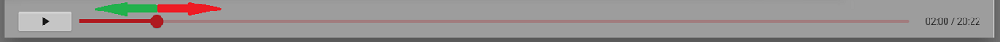

* A videó ablak megjelenését követően a videó alatti  **lejátszás gombbal** , vagy a **videóra kattintva** indíthatja el az anyag megtekintését.

* A nyitókép  néhány mp-ig látható, majd megkezdődik az előadás. A videó **megállítható**  és **újra indítható**  a két gomb segítségével. ***Azonban ha megállítja, és otthagyja a videót, 180 perc után a rendszer kilépteti a felhasználót.*** Ilyen esetben ezen fejezetet elölről szükséges végignéznie, ezért azt tanácsoljuk, hogy egy fejezetet egyszerre nézzen végig a rendszer zavartalan működése érdekében.

* **A videó léptetése** a képen látható csúszka segítségével történik. A kör alakú gombot húzni tudja az egér segítségével.

  

A videó az **alsó csúszka segítségével visszább léptethető**, viszont **előre nem léptethető, amíg nem teljesítette a fejezet teljes időtartamát**.    
A videó megállítása után, az adott anyag újraindításakor ugyanonnan folytathatja az anyagrészt, ahol azt előzetesen abbahagyta.  

