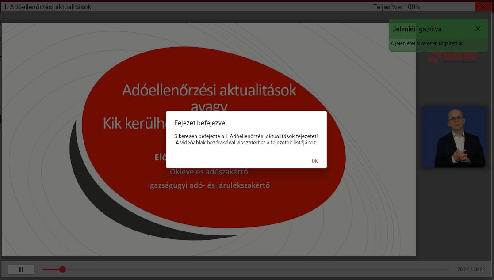

Amennyiben az adott fejezetet teljes egészében végignézte, a rendszer a video ablak közepén a **“Fejezet elvégezve!”** üzenet-ablakot dobja fel.   
Valamint a jobb felső sarokban a **Teljesítve: 100%-ot** fogja látni. Ilyenkor a videó ablak bezárásával folytathatja a többi fejezet megtekintését.

