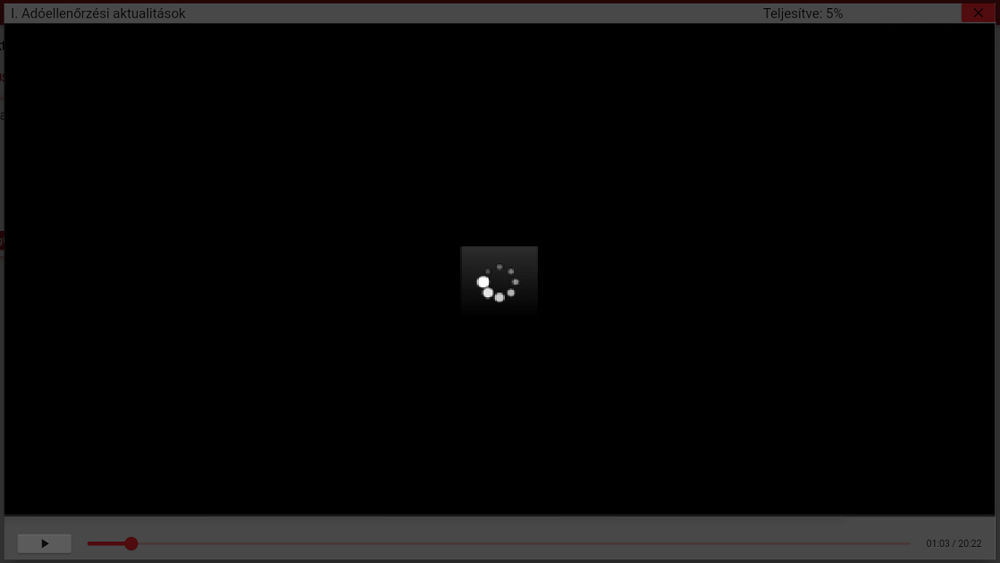

**Ön milyen böngészőt használ?** A rendszer használatához leginkább a **Google Chrome böngészőt javasoljuk**, másodsorban pedig a **Mozilla Firefox** vagy a **Microsoft Edge** böngészőt.  

* **Ha nem indul el a videó** az adott böngészőben, érdemes egy másik böngészővel megpróbálni a megtekintést. *(Internet Explorer böngészőt, főként régebbi verzióit nem javasoljuk használni!)*
  

* ​​Ha a fenti vagy ehhez hasonló képet lát, és nem töltődik be a videó, akkor **ellenőrizze az internet kapcsolatát**!  
Érdemes újraindítani a böngésző programot (bezárni a jobb felső X gombbal), majd újra megpróbálni a lejátszást.

* **Érdemes lehet a böngészési adatok közül törölni a gyorsítótárat és a sütiket (cookie)**, ehhez nyomja meg a Ctrl+Shift+Del(ete) billentyűket, ekkor a következő kép jelenik me

* **A böngésző vagy a számítógép újraindítása** is időnként megoldja a problémát. Vagy esetleg **másik gépen is célszerű ellenőrizni, hogy működik-e a lejátszás**.

* Főként **vállalati környezetben előfordulhat, hogy a rendszergazda letiltja bizonyos videók megtekintését**, vagy **VPN használata esetén**  vagy **több telephellyel rendelkező céges hálózatok esetén** a központosított internet szolgáltatás (proxy szerver) is korlátozhatja, vagy letilthatja az oldalak egyes részeit.
   
**Amennyiben nem talál megoldást keresse a Sämling munkatársait és segítünk!**

